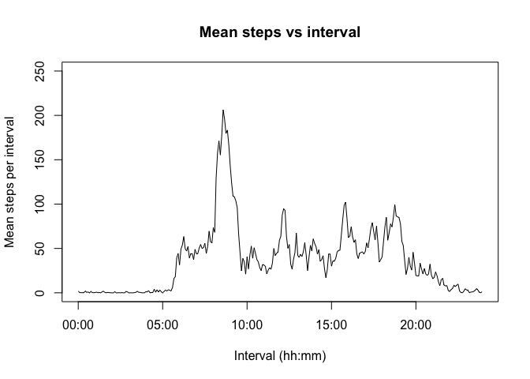
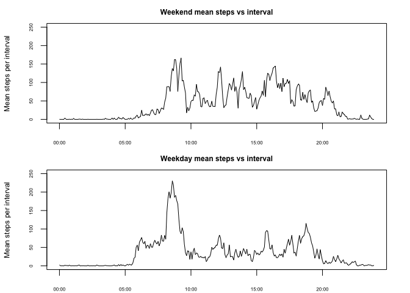

# Reproducible Research: Peer Assessment 1


## Loading and preprocessing the data
Show any code that is needed to  

1. Load the data (i.e. read.csv())  
2. Process/transform the data (if necessary) into a format suitable for your analysis  


```r
## Set the path and read in the data from the .zip file (change path if you need to)
dirPath         <- "~/Documents/Data Science Specialisation/5 - Reproducible Research/RepData_PeerAssessment1"
setwd(dirPath)
activityData                <- read.csv(unz("activity.zip", "activity.csv"))
```

## What is mean total number of steps taken per day?
For this part of the assignment, you can ignore the missing values in the dataset.  

1. Calculate the total number of steps taken per day  
2. If you do not understand the difference between a histogram and a barplot, research the difference between them. Make a histogram of the total number of steps taken each day  
3. Calculate and report the mean and median of the total number of steps taken per day  


```r
## Calculate the total steps as a function of day & remove NAs (this assumes that when present the NAs are 
## present for the entire day - I checked and they are, otherwise it would be wasting good data here)
stepsPerDay                 <- tapply(activityData$steps, activityData$date, sum)
stepsPerDay                 <- stepsPerDay[!is.na(stepsPerDay)]

## Draw histogram, compute and display mean and median value 
hist(stepsPerDay, main = "Total steps per day", xlab = "Steps per day", ylab = "Frequency / days", 
                                xaxt = "n", ylim = c(0,20), breaks = 25, col = "lightblue", cex.axis = 0.8)
axis(1, at = seq(from = 0, to = 22000, by = 2000), cex.axis = 0.8)
```

 

```r
message("Mean steps/day = ", round(mean(stepsPerDay),2), "  Median steps/day = ", median(stepsPerDay))
```

```
## Mean steps/day = 10766.19  Median steps/day = 10765
```

## What is the average daily activity pattern?
1. Make a time series plot (i.e. type = "l") of the 5-minute interval (x-axis) and the average number of steps taken, averaged across all days (y-axis)  
2. Which 5-minute interval, on average across all the days in the dataset, contains the maximum number of steps?  


```r
## Calculate mean values per interval & reformat intervals as POSIXt times (not integers) - this
## prevents spurious straight line segments appearing in the time series chart 
meanSteps                   <- tapply(activityData$steps, activityData$interval, mean, na.rm = TRUE)
intervals                   <- strptime(sprintf("%04d", as.numeric(names(meanSteps))), format="%H%M")

## Draw line plot and display highest mean steps/interval value and interval
plot(intervals, meanSteps, type="l", main="Mean steps vs interval", xlab="Interval (hh:mm)", 
                                                            ylab="Mean steps per interval", ylim= c(0,250))
```

 

```r
message("Maximum mean steps/interval = ", round(max(meanSteps),2), " at ", 
                  intervals[meanSteps==max(meanSteps)]$hour, ":", intervals[meanSteps==max(meanSteps)]$min)
```

```
## Maximum mean steps/interval = 206.17 at 8:35
```

## Imputing missing values
Note that there are a number of days/intervals where there are missing values (coded as NA). The presence of missing days may introduce bias into some calculations or summaries of the data.  

1. Calculate and report the total number of missing values in the dataset (i.e. the total number of rows with NAs)  
2. Devise a strategy for filling in all of the missing values in the dataset. The strategy does not need to be sophisticated. For example, you could use the mean/median for that day, or the mean for that 5-minute interval, etc.  
3. Create a new dataset that is equal to the original dataset but with the missing data filled in.  
4. Make a histogram of the total number of steps taken each day and Calculate and report the mean and median total number of steps taken per day. Do these values differ from the estimates from the first part of the assignment? What is the impact of imputing missing data on the estimates of the total daily number of steps?  


```r
## Compute the vector of NA value locations, output the total NAs and populate 
## the new data frame where the NAs will be over-written
missing                     <- is.na(activityData$steps)
message("No. of missing steps data instances = ", sum(missing))
```

```
## No. of missing steps data instances = 2304
```

```r
newActivityData             <- activityData

## Strategy - replace NAs with the relevant (rounded off) interval mean values 
## computed without the NAs.
newActivityData[missing,1]  <- round(meanSteps[as.numeric(names(meanSteps)) %in% 
                                                                         newActivityData[missing,3]] + 0.5)

## Compute steps per day and draw new histogram 
newStepsPerDay              <- tapply(newActivityData$steps, newActivityData$date, sum)
hist(newStepsPerDay, main = "Total steps per day (NAs replaced)", xlab = "Steps per day", 
       ylab = "Frequency / days", xaxt="n", ylim = c(0,20), breaks = 25, col = "lightblue", cex.axis = 0.8)
axis(1,  at = seq(from = 0, to = 22000, by = 2000), cex.axis = 0.8)
```

 

```r
## Compute and display new mean and median value for steps per day
message("Mean steps/day (NAs replaced) = ", round(mean(newStepsPerDay),2), 
                                            "  Median steps/day (NAs replaced) = ", median(newStepsPerDay))
```

```
## Mean steps/day (NAs replaced) = 10785.05  Median steps/day (NAs replaced) = 10910
```

The mean and median values are increased by 19 & 145 steps/day respectively. The increase in the 10 - 11k steps/day bin values in the histogram (compared to the previous version without the NA replacement by imputed values) reflects the additional mean values summing to give additional "mean" days (ie, in the 10-11k bin).

## Are there differences in activity patterns between weekdays and weekends?
For this part the weekdays() function may be of some help here. Use the dataset with the filled-in missing values for this part.  

1. Create a new factor variable in the dataset with two levels – “weekday” and “weekend” indicating whether a given date is a weekday or weekend day.  
2. Make a panel plot containing a time series plot (i.e. type = "l") of the 5-minute interval (x-axis) and the average number of steps taken, averaged across all weekday days or weekend days (y-axis). See the README file in the GitHub repository to see an example of what this plot should look like using simulated data.  


```r
## Create the new factor variable in the data frame
newActivityData$day         <- weekdays(as.POSIXct((as.character(newActivityData$date))))
newActivityData$day         <- as.factor(ifelse(newActivityData$day %in% c("Saturday", "Sunday"), 
                                                                                      "Weekend", "Weekday"))

## Calculate the mean steps per interval for both weekdays and weekends
meanStepsWeekday            <- tapply(newActivityData[newActivityData$day=="Weekday", 1], 
                                                   newActivityData[newActivityData$day=="Weekday", 3], mean)
meanStepsWeekend            <- tapply(newActivityData[newActivityData$day=="Weekend", 1], 
                                                   newActivityData[newActivityData$day=="Weekend", 3], mean)
intervals                   <- strptime(sprintf("%04d", as.numeric(names(meanStepsWeekday))), format="%H%M")

## Construct the two plots
par(mfrow = c(2, 1), mar=c(2,4,2,2))
plot(intervals, meanStepsWeekend, type="l", main="Weekend mean steps vs interval", cex.axis=0.5, 
        cex.lab=0.75, cex.main=0.75, xlab="Interval (hh:mm)", ylab="Mean steps per interval", ylim=c(0,250))
plot(intervals, meanStepsWeekday, type="l", main="Weekday mean steps vs interval", cex.axis=0.5, 
        cex.lab=0.75, cex.main=0.75, xlab="Interval (hh:mm)", ylab="Mean steps per interval", ylim=c(0,250))
```

 
